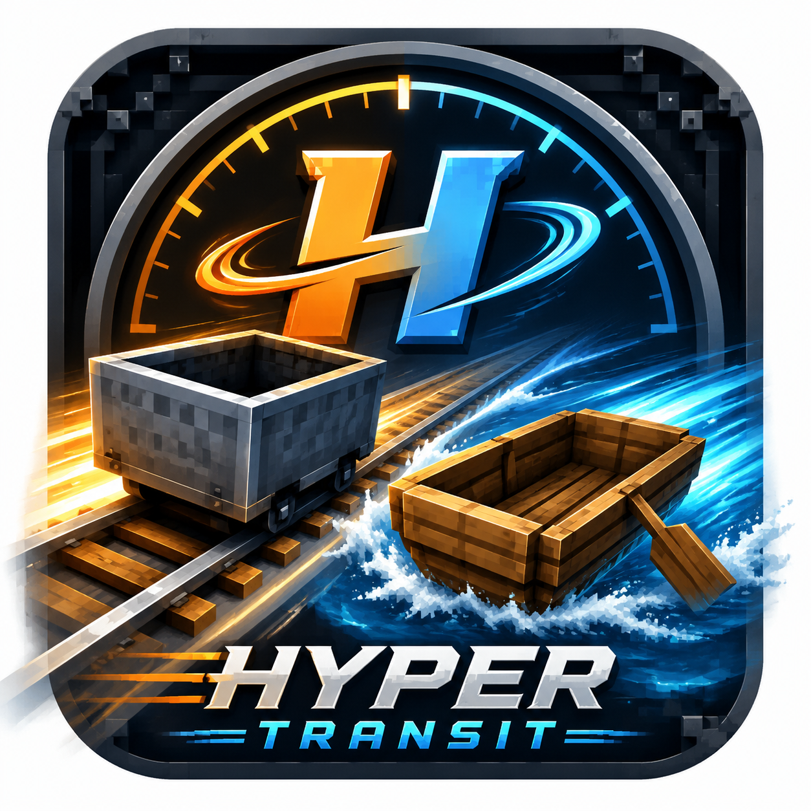

<div align="center">



# HyperTransit

更快的船和矿车！为 Minecraft 添加多种材质等级的高速载具。

[](LICENSE)
[](https://openjdk.org/)
[](https://www.minecraft.net/)
[](https://fabricmc.net/)

</div>

HyperTransit 是一个 Fabric 模组，为 Minecraft 添加更高级材质的**船**和**矿车**，拥有更高的速度倍率，其余特性与原版一致。

---

## 功能特性

### 高级船

| 船类型 | 速度倍率 | 合成材料 |
|--------|----------|----------|
| 铁船 | 1.5× | 铁锭 |
| 铜船 | 2× | 铜锭 |
| 金船 | 2.5× | 金锭 |
| 钻石船 | 3× | 钻石 |
| 下界合金船 | 3.5× | 下界合金锭 |

### 高级矿车

| 矿车类型 | 速度倍率 | 合成材料 |
|----------|----------|----------|
| 铜矿车 | 1.5× | 铜锭 |
| 金矿车 | 2× | 金锭 |
| 钻石矿车 | 3× | 钻石 |
| 下界合金矿车 | 4× | 下界合金锭 |

- 矿车速度倍率基于 `/gamerule minecartMaxSpeed`（新行为）或原版硬编码上限（旧行为）
- 所有高级载具的合成配方与原版船/矿车类似，仅替换材料
- 创造模式物品栏中位于「工具与实用物品」分类

---

## 版本对照表

> 每次发布新版本时同步更新此表。

| Mod 版本 | Minecraft | Fabric Loader | Fabric API | Java | 备注 |
|----------|-----------|---------------|------------|------|------|
| 1.0-alpha1 | 26.2 | 0.19.3+ | 0.155.2+26.2 | 25 | 首个 alpha 版本；Mojang 官方 mappings |

---

## 安装

### 前置模组

| 模组 | 说明 |
|------|------|
| [Fabric API](https://modrinth.com/mod/fabric-api) | **必需**。Fabric 模组的基础 API 库 |

### 环境要求

- Minecraft **26.2**
- Fabric Loader **0.19.3** 或更高
- Java **25** 或更高

将 HyperTransit 的 `.jar` 文件和 Fabric API 放入 `mods/` 文件夹，重启游戏即可。客户端和服务端均需安装。

---

## 从源码构建

```bash
# 克隆仓库
git clone https://github.com/suhoan/hypertransit.git
cd hypertransit

# 构建
./gradlew build

# 产物位于 build/libs/hypertransit-<版本>.jar
```

### 开发调试

```bash
# 生成 MC 反编译源码（Mojang 官方 mappings）
./gradlew genSources

# 启动开发客户端
./gradlew runClient
```

---

## 许可证

本项目基于 [Apache License 2.0](LICENSE) 开源。

Copyright (c) 2026 suhoan。详见 [LICENSE](LICENSE) 文件。
